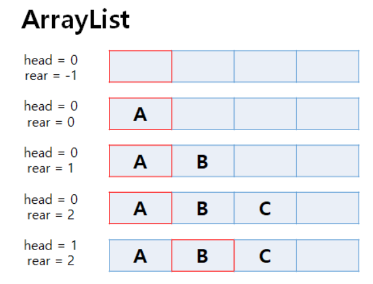
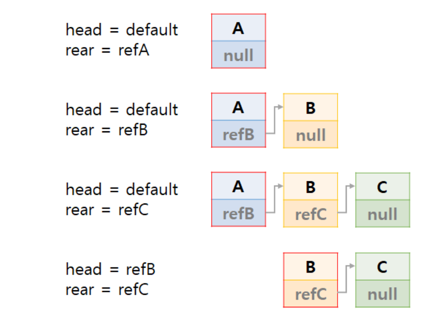

# 🍒1주차 발표: BOJ 프린터 큐 (1966)

## 💎 문제 분석 요약
Queue 자료구조에 따라 인쇄되는 프린터기의 원리
```java
1) 현재 Queue의 가장 앞 문서의 '중요도' 를 확인
2) 나머지 문서들 중 현재 문서보다 중요도가 높은 문서가 하나라도 있다면, 이 문서를 인쇄하지 않고 Queue의 가장 뒤에 재배치 한다. 
    그렇지 않다면 바로 인쇄

ex) 4개의 문서 [A,B,C,D]:          중요도 [2,1,4,3]  ->    출력 순서 C,D,A,B
```

#### 입력

- 테스트케이스 수 `T`
- 각 테스트 케이스 2줄
  - 첫 번째 줄 : `[문서의 개수 N] [몇 번째로 인쇄되는지 궁금한 문서가 초기에 놓여있는 위치 M]`
  - 두 번째 줄 : `[N개 문서의 중요도]`

#### 출력

- 궁금한 특정 문서가 출력되는 순서 값
## 💎 알고리즘 설계

1) 입력 값 받기 - BufferedReader

2) Queue 초기화 - Queue 를 LinkedList 로 구현, 이때 원소의 형태는 int [] 로 `초기 위치 , 중요도` 를 넣어준다.

3) 관심 있는 원소 - front 에 있는 원소가 가장 큰 원소인지 판단

## 💎 코드
```java
import java.io.BufferedReader;
import java.io.InputStreamReader;
import java.util.LinkedList;
import java.util.StringTokenizer;
public class Main {
    public static void main(String[] args) throws Exception{
      BufferedReader bf = new BufferedReader(new InputStreamReader(System.in));
      StringBuilder sb = new StringBuilder(); //테스트 케이스 마다 결과값을 담기 위해
    
      int T = Integer.parseInt(bf.readLine()); //테스트 케이스 개수
      int count; //각 테스트 케이스 결과
      while(T-- > 0 ){
        StringTokenizer st = new StringTokenizer(bf.readLine());
      
        int N = Integer.parseInt(st.nextToken()); //문서의 개수
        int M = Integer.parseInt(st.nextToken()); //몇 번째로 인쇄되는지 궁금한 문서가 초기에 놓여있는 위치
    
        LinkedList<int []> q = new LinkedList<>(); //queue로 활용할 연결리스트 (LinkedList)
        st = new StringTokenizer(bf.readLine()); //중요도 입력값
    
        for (int i = 0 ; i < N; i++){
          //{초기 위치, 중요도} 배열 형태로 넣기
          q.offer(new int[] {i, Integer.parseInt(st.nextToken())});
        }
    
      count = 0; //각 테스트 케이스 결과 = 관심 있는 원소의 출력 순서
      while(!q.isEmpty()){
        int[] front = q.poll(); //front에 위치한 원소 빼기
        boolean isMax = true; //front 원소가 가장 큰 원소인지를 판단하는 변수
    
        //front 원소를 나머지 원소들과 중요도 비교
        for (int i =0 ; i<q.size(); i++){
          //뽑은 원소 중요도 < i번째 원소의 중요도 인 경우
          if (front[1] < q.get(i)[1]){
            //뽑은 원소 및 i 이전의 원소들을 뒤로 보낸다. (한번에!!!)
            q.offer(front);
            for (int j = 0 ; j < i ; j++){
              q.offer(q.poll());
            }
            isMax = false;//front 값이 가장 큰 원소가 아님
            break;//for 문 break
          }
        }
        if (isMax == false)
          continue;
    
        //isMax == true 인 경우
        count++;//
        if (front[0] ==  M)//관심있는 원소의 초기 위치 == M
          break;
      }
      sb.append(count).append("\n");//각 테스트케이스에 대한 결과 값 추가
    
    }
    System.out.print(sb);
    }
}

```
```java
import java.io.BufferedReader;
import java.io.InputStreamReader;
import java.io.IOException;
import java.util.LinkedList;
import java.util.Queue;
import java.util.StringTokenizer;

public class PrinterQueue {
public static void main(String[] args) {
BufferedReader br = new BufferedReader(new InputStreamReader(System.in));
int T = Integer.parseInt(br.readLine());

        StringBuilder result = new StringBuilder();
        for (int t = 0; t < T; t++) {
            StringTokenizer st = new StringTokenizer(br.readLine());
            int N = Integer.parseInt(st.nextToken());
            int M = Integer.parseInt(st.nextToken()); 

            Queue<Document> queue = new LinkedList<>();
            st = new StringTokenizer(br.readLine());
            for (int i = 0; i < N; i++) {
                int priority = Integer.parseInt(st.nextToken());
                queue.add(new Document(i, priority));
            }

            int printOrder = 0;
            while (!queue.isEmpty()) {
                Document current = queue.poll();
                boolean hasHigherPriority = false;
                for (Document doc : queue) {
                    if (doc.priority > current.priority) {
                        hasHigherPriority = true;
                        break;
                    }
                }

                if (hasHigherPriority) {
                    queue.add(current);
                } else {
                    printOrder++;
                    if (current.index == M) {
                        result.append(printOrder).append("\n");
                        break;
                    }
                }
            }
        }
        System.out.print(result);
    }

    static class Document {//이너 클래스
        int index;
        int priority;

        Document(int index, int priority) {
            this.index = index;
            this.priority = priority;
        }
    }
}
```
## 💎 시간 복잡도

`N` : 문서의 개수

`T` : 테스트 케이스 수

( o(N) `초기 큐에 값 넣기` + O(N^2) `중요도 비교` ) X T = `O(N^2)`

## 💎 느낀점 OR 기억할 정보

`1` 처음 구현

    Queue<Integer> 형태로 큐를 사용 -> 변수가 너무 많아져 실수를 하는 문제

    =>  Queue<int []>   


`2` Queue를 LinkedList로 구현하는 이유
- ArrayList 로 구현하는 경우
  - 데이터가 계속 추가,삭제 되는 형태일때, ArrayList는 메모리가 늘어나게된다.
  
- LinkedList로 구현하는 경우
  - 메모리를 아낄 수 있다.
  


<details>
<summary>출처</summary>
<div>

[Queue가 LinkedList로 구현된는 이유](https://velog.io/@eora21/queue%EB%8A%94-%EC%99%9C-LinkedList%EB%A1%9C-%EA%B5%AC%ED%98%84%EB%90%98%EB%8A%94%EA%B0%80)

[소요되는 시간 절약 위해 BufferedReader 사용](https://velog.io/@langoustine/Scanner-VS-BufferedReader)

</div>
</details>