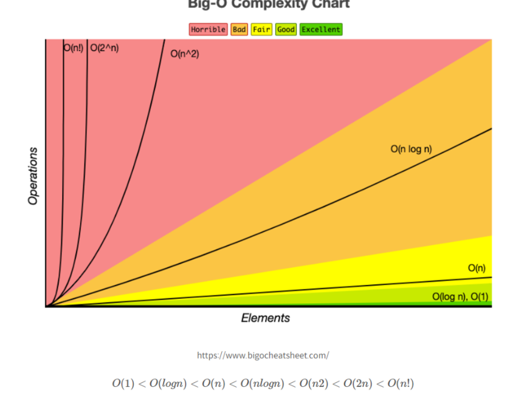

[영상](https://www.youtube.com/watch?v=rlNLhAmNlfI)

시간복잡도: 입력된 N의 크기에 따라 실행되는 조작의 수

공간복잡도: 알고리즘이 실행될 때 사용하는 메모리의 양

---

문제조건에서 힌트 얻는 공식 (1억번 연산 = 1초)

<aside>
🍏 시간복잡도 - 빅 오 표기법(worst case 를 나타내는)

</aside>

알고리즘의 수행시간 = `기본 연산`의 실행횟수로 평가 (수행시간은 실행환경에 따라 다르게 측정되기 때문에)

- 기본 연산
    - 데이터 입출력
    - 산술 연산-add, multiply
    - 제어 연산-if,while


*ex) 시간복잡도 계산 예제*

```java
//T(n) = O(log n)    2^k =n (k는 수행횟수)이기 때문
for(i=1; i<=n; i*2) {
  ...
}
//T(n) = O(2^n)     한번 함수를 호출할 때마다 두 번씩 재귀로 함수를 호출하기 떄문
int func (int n) {
  if (n <= 1) 
    return n;
  return func(n-1) + fun(n-2);
}
```


→ 빅 오 표기버으로 나타낸 [정렬 알고리즘별 복잡도](https://velog.io/@welloff_jj/Complexity-and-Big-O-notation)를 보았다. 이 부분도 다시 정리를 해야겠다.

<aside>
🍏 공간 복잡도

</aside>

*ex) 공간복잡도 계산 예제*

```java
//O(n)     배열 a 는 int(4 bytes)배열이므로, n개의 int를 저장해야하므로 4n
int sum(int a[], int n)
{
  int x = 0;		
  for(int i = 0; i < n; i++) {
    x  = x + a[i];
  }
  return(x);
}
//O(n)     재귀함수로 1까지 호출하였을 경우 n부터 1까지 스택에 쌓이게 됨
int factorial(int n){
	if (n== 1)
		return n;
	return n * factorial(n-1);
}
```