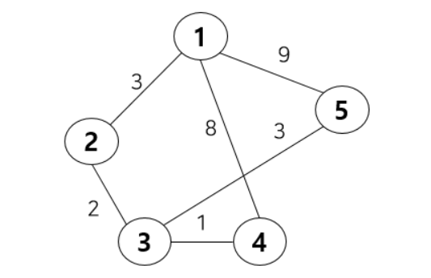

## 최단경로

[문제집 참고](https://riverrevir.github.io/2022/03/17/dijkstra.html)

최단거리 알고리즘 정리
1. 다익스트라 (Dijkstra)
2. 플로이드 워설 (Floyd Warshall)
3. 벨만 포트 (Bellman Ford)

### 다익스트라

```java
그래프 상에서 특정 `한 노드에서 다른 모든 노드까지의 최단거리`를 구하는 알고리즘

가중 그래프에서 간선 가중치의 합이 최소가 되는 경로를 찾는 알고리즘 
```

음의 가중치가 있으면 안됨.



- 초기 모델은 O(V^2)의 시간복잡도를 가졌다. 이후 우선순위 큐 등을 이용한 고안된 알고리즘이 탄생했고, 현재는 O((V+E)log V)의 시간복잡도를 가지고 있다(만일 연결 그래프라면 O(ElogV)까지 시간 복잡도를 줄일 수 있다고 한다). 일반적으로는 그래프가 희소 그래프인 경우에 우선순위 큐를 이용하는 것이 낫다고 한다.

#### [다익스트라 알고리즘의 구현 : 선형탐색 O(V^2)](https://github.com/Hyeri1ee/algorithm-8.19-/blob/master/src/week5/day1/Dijkstra.java)

- 입력으로 주어진 그래프를 저장하는 방법
  - 한 번 방문한 배열은 방문할 수 없으므로 *방문여부를 체크할 배열* 이 필요
  - *각 노드까지의 최소 비용을 저장할 배열*
  - 최소 비용을 갖는 노드를 선택하는 과정은 최악의 경우 모든 노드를 확인해야 하고, 이것을 V번 반복하기 때문에 시간복잡도가 O(V^2) 이다.

#### [다익스트라 알고리즘 구현 : 인접 리스트 O(V^2)]()

- 배열로 구현한 것과 거의 똑같음

#### [다익스트라 알고리즘 구현 : 우선순위 큐 O(ElogV)]()


다익스트라	벨만-포드

음수 가중치	X	O

음수 사이클	X	X

시간복잡도	O(mlog n)	O(mn)

---

