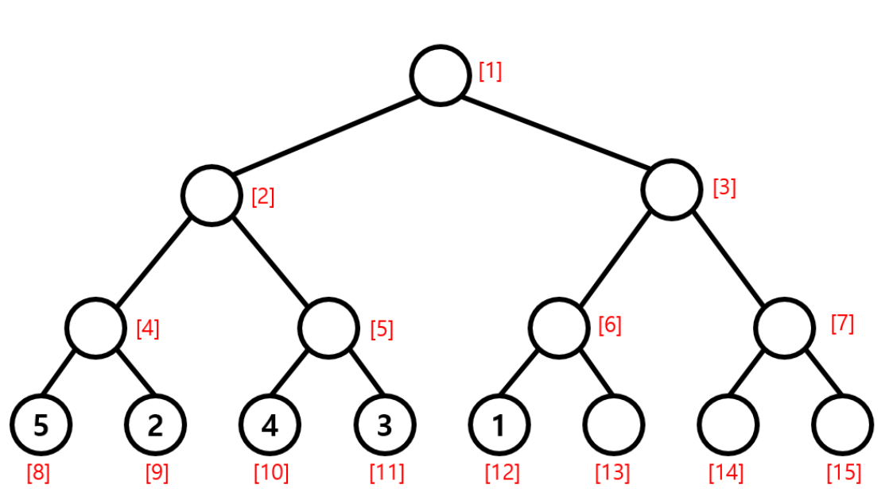
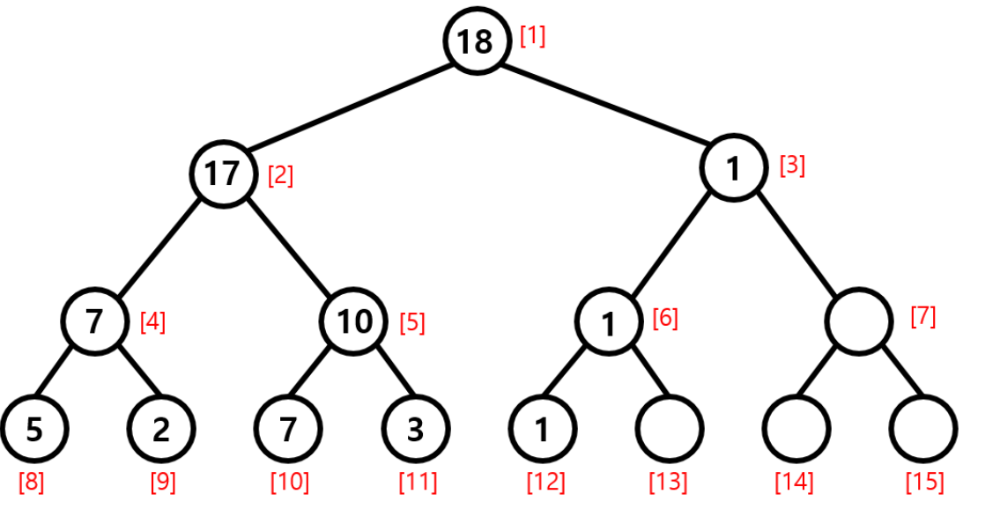

### 세그먼트 알고리즘

#### 세그먼트 트리(Segment Tree)

- 데이터 집합이 주어지고, 특정 구간의 합, 최대, 최소 값을 구해야하는 문제가 주어짐
- 이때, 구간이 여러개이거나 데이터가 업데이트 될 수 있는 상황에서 더 빠르게 찾아내기 위해 고안된 자료구조

#### 세그먼트 트리 사용 예제

- 입력으로 5,2,4,3,1 이 들어왔다고 가정 + 업데이트를 반영한 구간합을 출력해야 하는 상황

---- 
##### 트리 초기화



- 각각의 부모 노드들에 값을 채워넣음 => arr[ i ] = arr[ i * 2 ] + arr[ i * 2 + 1]
- arr[1~15] = [15, 14, 1, 7, 7, 1, 0, 5, 2, 4, 3, 1, 0, 0, 0]

##### 데이터 업데이트

- 3번째 값인 4를 7로 바꿔야 하는 상황
- 3번째 값의 처음 index = 10 => arr[10]을 4에서 7로 바꾸고 둘의 차이인 +3을 저장
- 부모 노드를 따라가면서 둘의 차이인 +3 더해줌
  - index를 2로 나눠주면서 1까지 가면 됨
- arr[1~15] = [18, 17, 1, 7, 10, 1, 0, 5, 2, 7, 3, 1, 0, 0, 0]

##### 구간합 계산



##### 구현

```java
public SegmentTree(int[] nums) {
        this.nums = nums;
        int n = nums.length;
        // 세그먼트 트리의 크기는 주어진 배열 크기의 4배 이상이어야 합니다.
        tree = new int[4 * n];
        build(0, 0, n - 1);
    }
```
`SegmentTree(int[] nums)`

- 생성자 함수로 세그먼트 트리를 초기화합니다.
- `nums` 배열을 입력으로 받아 세그먼트 트리를 구축합니다.
- 세그먼트 트리를 구축하기 위해 build 함수를 호출합니다.

```java
private void build(int node, int start, int end){
  if (start == end){
    tree[node] = nums[start];
  }else{
    int mid = (start + end) / 2;
    int leftNode = 2 * node + 1;
    int rightNode = 2 * node + 2;
    build(leftNode, start, mid);
    build(rightNode, mid+1, end);
    tree[node] = tree[leftNode] + tree[rightNode]; //구간 합을 저장

  }
}
```

`build(int node, int start, int end)`

- 세그먼트 트리를 구축하는 재귀함수입니다.
- node는 현재 노드의 인덱스를 나타냅니다.
- 재귀적으로 왼쪽 자식 노드와 오른쪽 자식 노드르 구축하고, 해당 구간의 합을 현재 노드에 저장합니다.

```java
public void update(int index, int val){
  update(0,0,nums.length-1, index, val);
}

private void update(int node, int start, int end, int index, int val){
  if (start == end){
    nums[index] = val;
    tree[node] = val;
  }else{
    int mid = (start + end) /2;
    int leftNode = 2 * node + 1;
    int rightNode = 2 * node + 2;
    if (index <= mid){
      update(leftNode, start, mid, index, val);
    }else{
      update(rightNode, mid+1, end, index, val);
    }
    tree[node] = tree[leftNode] + tree[rightNode]; //구간합 업데이트
  }
}
```

`update(int index, int val)`

- 배열의 특정 인덱스를 업데이트하는 함수입니다.

```java
public int query(int left, int right){
  return query(0,0,nums.length-1, left, right);
}

private int query(int node, int start, int end, int left, int right){
  //구하고자 하는 구간 [left, right], 노드가 담당하는 구간 [start,end]
  if (right < start || left > end){
    return 0; //범위가 겹치지 않으면 0 반환
  }else if (left <= start && right >= end){
    return tree[node];
  }else{
    int mid = (start + end) / 2;
    int leftNode = 2 * node + 1;
    int rightNode = 2 * node + 2;
    int leftSum = query(leftNode, start, mid, left, right);
    int rightSum = query(rightNode,mid+1, end, left, right);
    return leftSum + rightSum;
  }
}
```

`query(int left, int right)`

- 구간 합을 계산하는 함수입니다.
- 효율적인 구간 합 계산을 위해 세그먼트 트리를 사용합니다.

<details>
<div>

[세그먼트트리](https://yoongrammer.tistory.com/103)

</div>
</details>